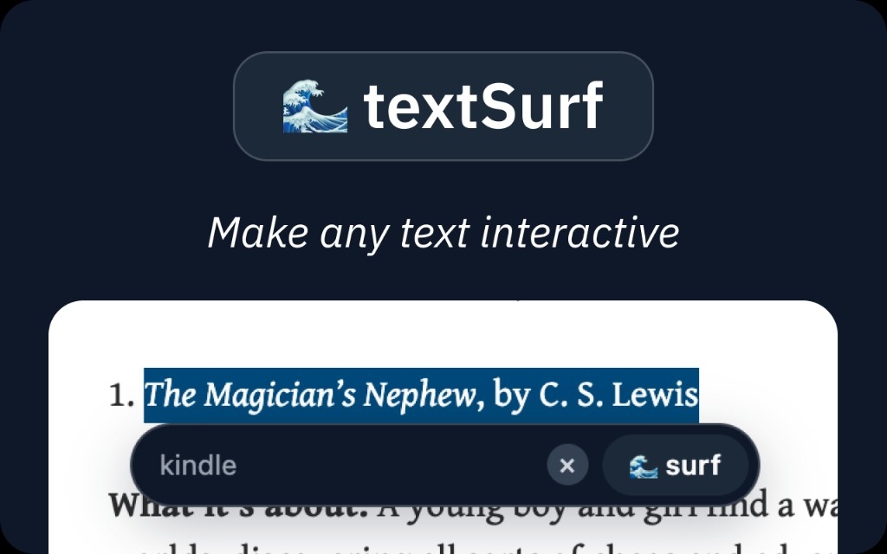
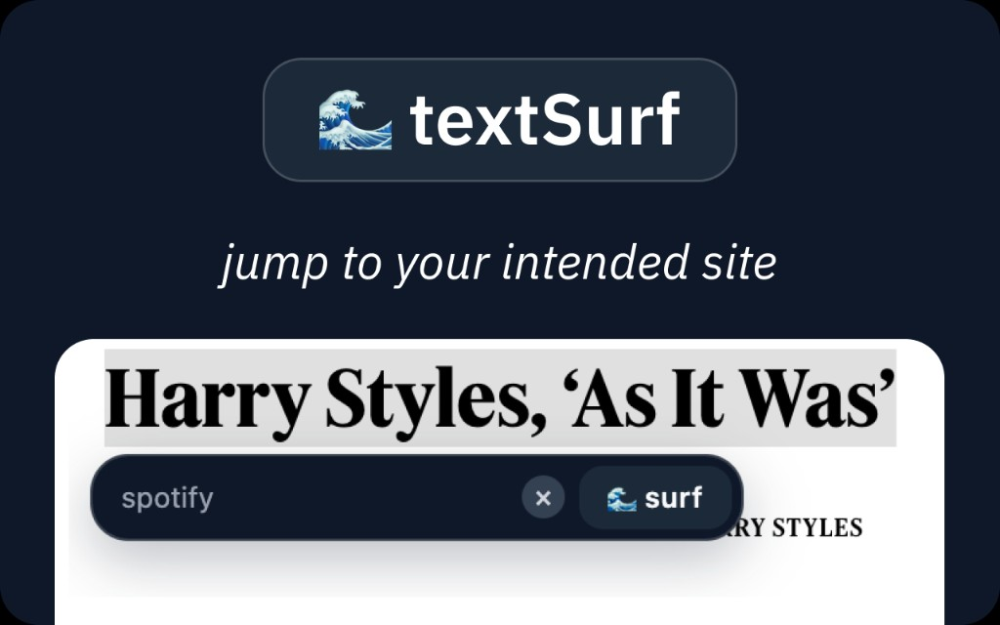
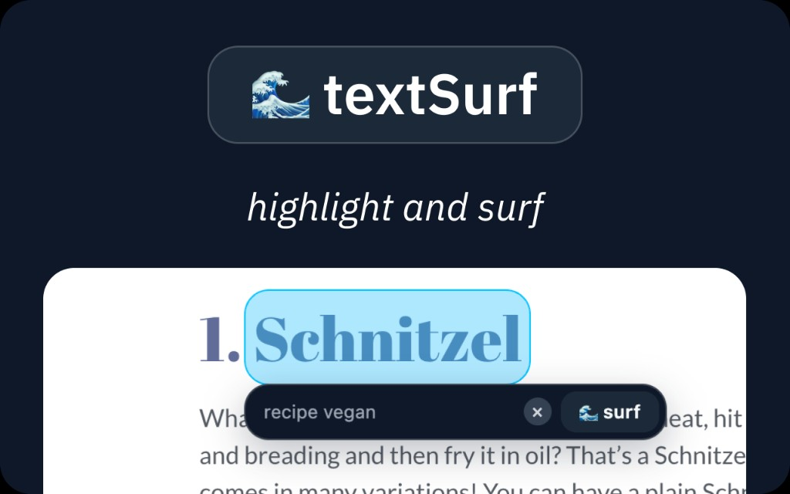
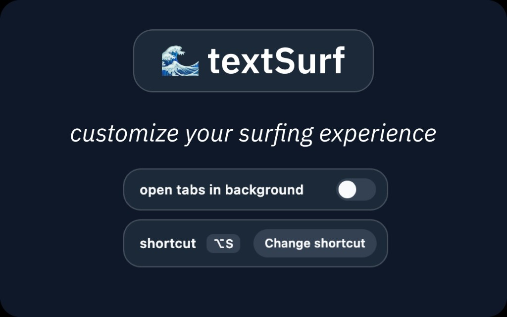

# textSurf

Highlight any word, add a note like `spotify` or `kindle`, and jump straight to the page you meant.

**[Add to Chrome](https://chromewebstore.google.com/detail/textsurf/lomniglinjagabpdoebpmdimihadgped)** — this is the official listing.

## Demo









## How to use

1. Hold **Option+S** (Mac) or **Alt+S** (Windows/Linux).
2. Hover a word or highlight a phrase.
3. Type an optional note — where you want to go.
4. Click **surf**. Keep holding the shortcut to surf more words; release it to dismiss.

Open the toolbar icon to open new tabs in the background or change the shortcut.

## What’s next (1.1.0)

- Cleaner highlights (no leftover characters)
- Spotlight-style launcher
- Smarter last-note from page context (only when Nano decides to replace it)
- Works on PDFs and Chrome’s new tab page
- More reliable on pages that currently fail to connect
- Rename to **contextSurf**
- License may become open source
- TypeScript port

## Privacy

See [PRIVACY.md](PRIVACY.md).

## License

Proprietary. Copyright (c) 2026 Sergej Gavrilov. All rights reserved. See [LICENSE](LICENSE).

## Developers

```bash
npm install
npm run build
```

`chrome://extensions/` → Developer mode → **Load unpacked** → `dist/`
